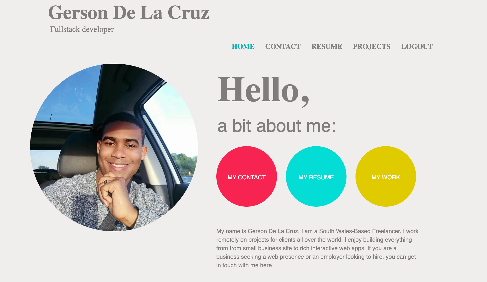

 # Welcome to my portfolio

[View my live portfolio here.](http://www.gersondelacruz.com/)

This is my portfolio website. Its purpose is to show off my work to potential clients  or employee and others interested in seeing an example of my porfolio.
The entire page is responsive and customized for desktop, tablets and mobile phone. The design is largely focused on giving the viewer an immediate view of the quality of my work and making it easy for employee to get in touch width me.

 

## Technologies used

* This site was built with HTML, CSS, Javascript and Python languages and with Python framework [Django](https://www.djangoproject.com/)

* The following Python modules were used in this project (can also be found in requirements.txt file):
    * django-countries=7.1
    * asgiref==3.3.1
    * boto3==1.17.33
    * botocore==1.20.33
    * Django==3.1.7
    * django-ckeditor==6.0.0
    * django-crispy-forms==1.9.2
    * django-debug-toolbar==2.2
    * django-filter==2.4.0
    * django-js-asset==1.2.2
    * django-storages==1.11.1
    * gunicorn==20.0.4
    * jmespath==0.10.0
    * Pillow==7.2.0
    * psycopg2-binary==2.8.5
    * python-dateutil==2.8.1
    * pytz==2021.1
    * s3transfer==0.3.6
    * six==1.15.0
    * sqlparse==0.4.1
    * urllib3==1.26.4
    * whitenoise==5.1.0

* [Git](https://git-scm.com/) was used for version control

* [Github](https://github.com/) was used for hosting and store source code

* [Heroku](https://heroku.com) was used for deployment of live site

* [Heroku PostgresSQL](https://www.postgresql.org/) was used for relational database storage

* [jQuery](https://jquery.com/) was used for simplified use of javascript

* [Bootstrap](https://getbootstrap.com/) was used throughout the site for creating layout and responsiveness

* [Canva](https://www.canva.com/) was used for testing different colors and design and for getting the drawn images on the site

* [Google Fonts](https://fonts.google.com/) was used for importing the font used on the site

* [Font Awesome](https://fontawesome.com/) was used for icons 

* [Diagrams.net](https://www.diagrams.net/) was used for creating the database design schema

* [AWS S3 Bucket](https://aws.amazon.com/) was used for storing static and media files

* [Picresize](https://picresize.com/) was used for resizing images used on the site

* [Google Chrome Developer Tools](https://developer.chrome.com/docs/devtools/) was used for inspecting elements on the site to debug positioning and grid issues and test      
  responsiveness on different screen sizes

* [Unicorn Revealer Tool](https://chrome.google.com/webstore/detail/unicorn-revealer/lmlkphhdlngaicolpmaakfmhplagoaln?hl=en-GB) was used for analyzing positioning and grid 
  issues

* [Pep8 Online](http://pep8online.com/) was used for validating Python code 

* [Autoprefixer](https://autoprefixer.github.io/) was used for autoprefixing CSS code 

* [Free formatter CSS beautifier](https://www.freeformatter.com/css-beautifier.html) was used to ensure proper formatting of CSS code

* [Free formatter HTML beautifier](https://www.freeformatter.com/html-formatter.html) was used to ensure proper formatting of HTML code 

* [Lighthouse](https://developers.google.com/web/tools/lighthouse) was used in Chrome Dev tools version to test the site for acessibility and performance

